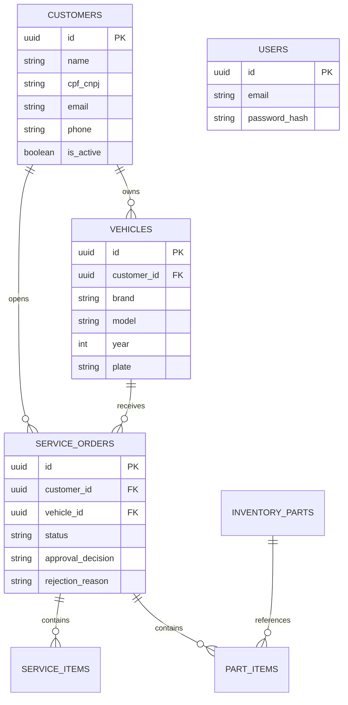

# Database ER

```mermaid
erDiagram
  CUSTOMERS ||--o{ VEHICLES : owns
  CUSTOMERS ||--o{ SERVICE_ORDERS : opens
  VEHICLES ||--o{ SERVICE_ORDERS : receives
  SERVICE_ORDERS ||--o{ SERVICE_ITEMS : contains
  SERVICE_ORDERS ||--o{ PART_ITEMS : contains
  INVENTORY_PARTS ||--o{ PART_ITEMS : references
  USERS {
    uuid id PK
    string email
    string password_hash
  }
  CUSTOMERS {
    uuid id PK
    string name
    string cpf_cnpj
    string email
    string phone
    boolean is_active
  }
  VEHICLES {
    uuid id PK
    uuid customer_id FK
    string brand
    string model
    int year
    string plate
  }
  SERVICE_ORDERS {
    uuid id PK
    uuid customer_id FK
    uuid vehicle_id FK
    string status
    string approval_decision
    string rejection_reason
  }
```
